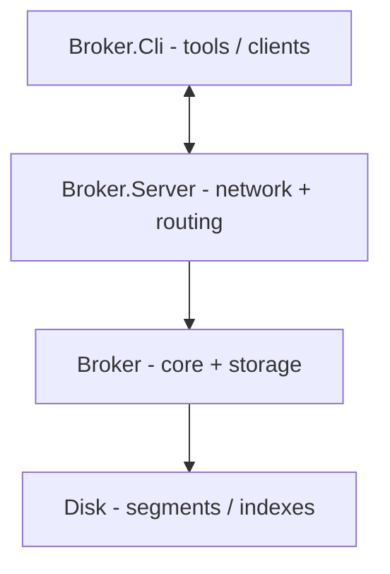
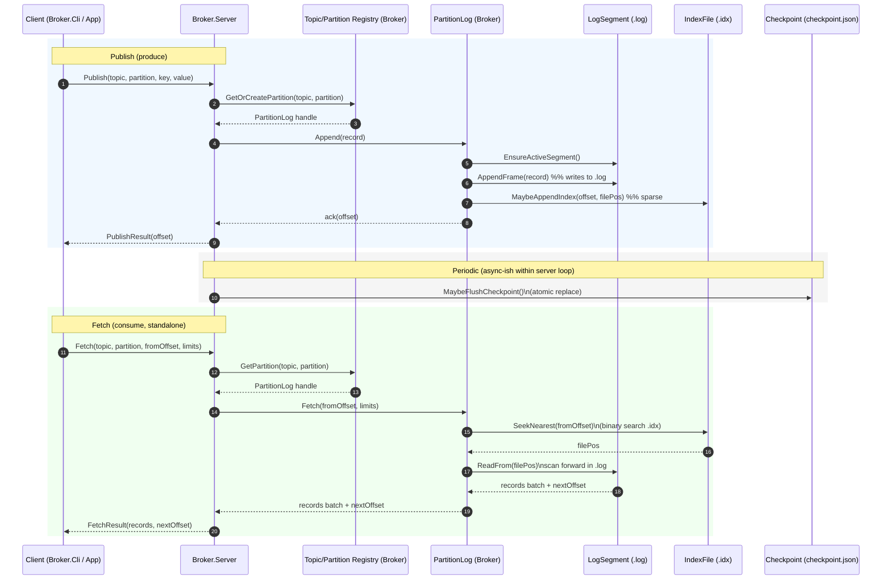

# Architecture

This document describes the minimal system decomposition for the **csharp-message-broker** project.

## Repository projects

- **Broker**
  - Shared core library.
  - Owns the storage engine abstractions, domain types, and common utilities.

- **Broker.Server**
  - The broker runtime (network server + request routing).
  - Hosts the storage engine from `Broker`.

- **Broker.Cli**
  - Developer/client tooling.
  - Used to publish/fetch messages and to inspect broker state for debugging.

- **Broker.Test**
  - Unit tests for `Broker` and (where practical) server components.

- **(Optional) Broker.IntegrationTest**
  - Black-box tests that spin up `Broker.Server` and use `Broker.Cli` (or a test client) to validate end-to-end behavior.

---

## High-level component diagram

---

## Core runtime model (v1)

### 1) Network / API Layer (Broker.Server)
**Responsibility**
- Accept client requests (publish/fetch).
- Validate request sizes and inputs.
- Route requests to the correct topic-partition.

**Owns state**
- Connection lifecycle, request parsing, response serialization.
- Request-scoped limits (max request size, max batch, timeouts).

### 2) Topic/Partition Registry (Broker)
**Responsibility**
- Map `(topic, partition)` to an in-memory `PartitionLog` instance.
- Create directories/initial segment lazily on first use (or via admin command later).
- Expose topic metadata for standalone consumers (e.g., list partitions for a topic).

**Owns state**
- In-memory registry of partitions and their handles.

### 3) PartitionLog (Broker)
**Responsibility**
- Append records in offset order.
- Serve reads by offset.
- Segment rolling (when active segment hits thresholds).
- Coordinate with retention and checkpointing.

**Owns state**
- `log_end_offset` (next offset to assign).
- Active segment handle.
- Ordered list of segments.

### 4) Segment Store: LogSegment + IndexFile (Broker)
**Responsibility**
- Implement file IO:
  - `.log` append framed records
  - `.idx` sparse offset -> file-position index
  - optional `.timeidx` for time-based seeks
- Recovery primitives:
  - scan frames, validate, truncate partial tail
  - rebuild index if missing/corrupt

**Owns state**
- Open file streams and per-segment metadata.

### 5) Checkpoint & Recovery (Broker)
**Responsibility**
- Persist fast-startup metadata (checkpoint).
- On startup: recover and truncate to last valid frame if needed.

**Owns state**
- Checkpoint read/write and startup recovery procedure.

### 6) Retention Worker (Broker)
**Responsibility**
- Periodically delete old *closed* segments based on time/size policies.
- Use `.tomb` marker files for crash-safe deletion.

---

## Storage ownership and truth

- **Source of truth:** `*.log` segment files (append-only record frames).
- **Derived accelerators:** `*.idx` and optional `*.timeidx` (rebuildable from logs).
- **Startup accelerator:** `data/meta/checkpoint.json` (rebuildable by scanning segments).
- **Node identity:** `data/meta/broker.id` (created once, never changes).

This distinction is important for crash recovery: if checkpoint or index files are stale/corrupt, the broker rebuilds them from the log segments.

---

## Concurrency model (v1)

### Partition-level single writer
To keep correctness simple and match the storage format:
- **Exactly one writer per partition** at a time.
- Implemented via a per-partition lock/queue (e.g., `SemaphoreSlim`, mailbox/Channel, or actor).

### Concurrent reads
- Reads may be concurrent with each other.
- Reads may run concurrently with appends as long as they:
  - use a snapshot of the current segment list
  - never read beyond the last known valid `log_end_offset`

### Coordination with roll/retention
- Segment roll and retention decisions must be coordinated with the partition writer lane to avoid races (e.g., deleting a segment while it is still referenced).

---

## Request flows (v1)

### Publish (produce)
1. `Broker.Server` receives publish request.
2. Route to `(topic, partition)`.
3. `PartitionLog.Append(...)`:
   - ensure active segment exists
   - append framed record to `.log`
   - update `.idx` (sparse)
   - update in-memory `log_end_offset`
4. Periodically persist `checkpoint.json` (atomic replace) according to flush policy.

### Fetch (consume, standalone)
1. `Broker.Server` receives fetch request with `fromOffset`.
2. Route to `(topic, partition)`.
3. `PartitionLog.Fetch(fromOffset, ...)`:
   - find segment containing `fromOffset`
   - use `.idx` to seek into `.log`
   - scan forward and stream records up to limits

### Metadata (standalone)
- `ListTopics()` (optional)
- `ListPartitions(topic)` (v1 equivalent of Kafka `partitionsFor()`)

---

## What’s explicitly out of scope for v1

To match the v1 scope in the project overview, the broker intentionally does **not** implement the following:

- Consumer groups.
- Rebalancing.
- Broker-managed committed offsets (offset storage).
- Exactly-once semantics.
- Replication / clustering.
- Compaction / key-based indexing.

These can be layered later without changing the fundamental append-only log segment model.

---

## V2 Architecture Goals (Next Milestone)

V2 builds on the v1 storage engine and adds coordinated consumption.

### Additions in v2

1) **Consumer group coordinator (Broker.Server + Broker)**
- Track group membership (join/leave/heartbeat).
- Assign partitions to group members (rebalance).

2) **Committed offset store (Broker)**
- Persist committed offsets per `(group, topic, partition)`.
- Storage options:
  - Simple file-backed store under `data/meta/consumer-offsets/` (good for learning)
  - Or an internal offsets topic (Kafka-like approach)

3) **Rebalance-aware fetch semantics (Broker.Server)**
- Enforce that a consumer may only fetch partitions currently assigned to it (for group mode).

4) **Stronger backpressure / quotas (optional)**
- Server-side controls for high fan-in/fan-out (limits, throttling, lag tracking).

### Testing additions in v2
- Integration tests for join/heartbeat/rebalance.
- Restart recovery of committed offsets.